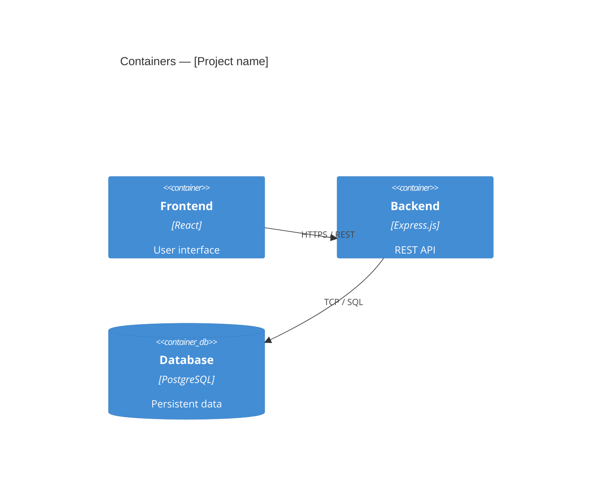

# Software Architecture

<!--
Software architecture documentation — recommended arc42 + C4 views structure.
Complete only the views that bring value for this project.
-->

## 1. Introduction and goals

<!--
Briefly recall the key architectural requirements and constraints that drove
the design decisions (link to sw-requirements.md).
-->

| Quality attribute | Key scenario                          | Priority |
|-------------------|---------------------------------------|----------|
| Performance       | …                                     | High     |
| Availability      | …                                     | High     |
| Security          | …                                     | High     |
| Maintainability   | …                                     | Medium   |

## 2. Constraints

- Imposed technical constraints: see [constraints.md](../requirements/constraints.md)
- Selected architectural style: _Monolith / Microservices / Event-driven / …_
- Justification: [[ADR-XXXX]]

## 3. Container view (C4)

## 4. Component view (C4)

<!--
Decompose key containers into internal components.
Only document complex or non-trivial containers.
-->

### Backend — main components

| Component      | Responsibility                    | Pattern       |
|----------------|-----------------------------------|---------------|
| API Layer      | Routing, validation, auth         | Controller    |
| Application    | Use cases, orchestration          | Service       |
| Domain         | Business logic, invariant rules   | Domain Model  |
| Infrastructure | DB, cache, messaging, adapters    | Repository    |

## 5. Cross-cutting concerns

### Authentication and authorisation
<!--
Describe the mechanism: JWT, OAuth2, RBAC, etc.
Link to the corresponding ADR.
-->

### Error handling
<!--
Convention: error codes, propagation, logging.
-->

### Cache strategy
<!--
Cache levels, TTL, invalidation.
-->

### Observability
<!--
Logs (format, level), metrics, distributed traces.
-->

## 6. Architecture decisions (ADR)

- [[ADR-XXXX]] — _Title_

## Reference

- SW requirements: [../requirements/sw-requirements.md](../requirements/sw-requirements.md)
- Detailed design: [../design/sw-detailed-design.md](../design/sw-detailed-design.md)
- Interfaces: [interfaces/api-contracts.md](interfaces/api-contracts.md)
