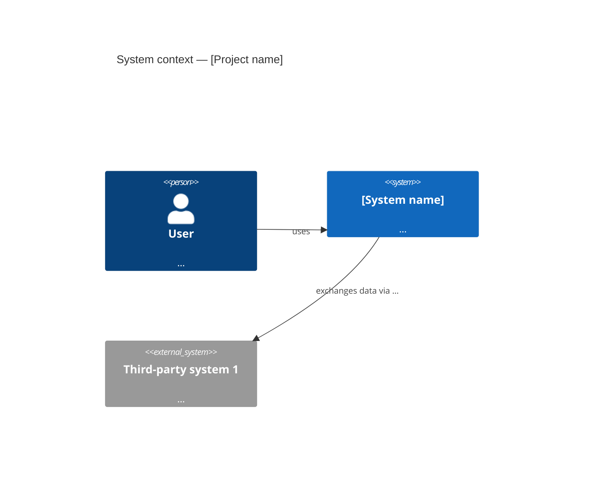

# System Architecture

<!--
System architecture overview (C4 Context + Container level,
or system block diagram depending on the SW/HW/mixed nature of the project).
This document is the reference for allocating requirements to subsystems.
-->

## 1. Context view (Context Diagram)

<!--
Place the C4 Context diagram or equivalent here.
Show: the system, external actors, third-party systems.
-->

## 2. System decomposition (Block Diagram)

<!--
Decompose the system into major subsystems.
Show flows between blocks (data, power, mechanical signal).
-->

| Subsystem    | Role                              | Technology / Nature  | Responsible team |
|--------------|-----------------------------------|----------------------|-----------------|
| …            | …                                 | SW / HW / Mixed      | …               |

## 3. Requirements allocation

| SYS requirement | Allocated subsystem | Allocation note |
|-----------------|---------------------|-----------------|
| SYS-F001        | …                   | …               |
| SYS-P001        | …                   | …               |

## 4. Operating modes

| Mode      | Description                         | Entry conditions    | Exit conditions      |
|-----------|-------------------------------------|---------------------|----------------------|
| Nominal   | …                                   | …                   | …                    |
| Degraded  | …                                   | …                   | …                    |
| Safe      | …                                   | …                   | Always reachable     |

## 5. Major system interfaces

| Interface | Between           | Type          | Referenced ICD        |
|-----------|-------------------|---------------|-----------------------|
| IF-001    | SW ↔ HW           | SPI / I2C / … | [electrical-icd.md](interfaces/electrical-icd.md) |
| IF-002    | System ↔ External | REST / MQTT   | [api-contracts.md](interfaces/api-contracts.md) |

## 6. Architecture decisions (ADR)

- [[ADR-0001]] — _Decision title_

## Reference

- SW: [sw-architecture.md](sw-architecture.md)
- HW: [hw-architecture.md](hw-architecture.md)
- Requirements: [../requirements/system-requirements.md](../requirements/system-requirements.md)
