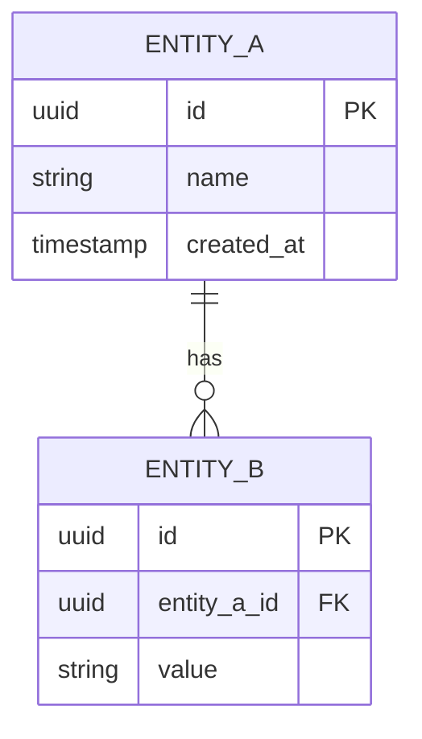

# Data Model

<!--
Data schema, formats, persistence.
Single source of truth for data structure — must remain consistent with DB migrations.
-->

## 1. Entity-relationship diagram

## 2. Entity descriptions

### ENTITY_A

| Column       | Type          | Nullable | Constraint          | Description            |
|--------------|---------------|----------|---------------------|------------------------|
| id           | UUID          | No       | PK, default gen_uuid| Unique identifier      |
| name         | VARCHAR(255)  | No       | UNIQUE              | …                      |
| created_at   | TIMESTAMP     | No       | default NOW()       | Creation date          |

### ENTITY_B

| Column       | Type          | Nullable | Constraint          | Description            |
|--------------|---------------|----------|---------------------|------------------------|
| id           | UUID          | No       | PK                  | …                      |
| entity_a_id  | UUID          | No       | FK → ENTITY_A(id)   | …                      |
| value        | TEXT          | Yes      | —                   | …                      |

## 3. Indexes

| Table     | Indexed columns     | Type   | Justification                     |
|-----------|---------------------|--------|-----------------------------------|
| ENTITY_B  | entity_a_id         | B-tree | Frequent queries by parent entity |

## 4. Migrations

<!--
Reference migration files (Flyway, Liquibase, TypeORM migrations).
-->

| Number    | Description                              | File                           |
|-----------|------------------------------------------|--------------------------------|
| V001      | Initial schema creation                  | `migrations/V001__init.sql`    |

## 5. Exchange formats

| Format  | Usage                          | Schema / Reference                |
|---------|--------------------------------|-----------------------------------|
| JSON    | REST API (inputs/outputs)      | [api-contracts.md](../architecture/interfaces/api-contracts.md) |
| CSV     | Report exports                 | …                                 |

## Reference

- SW Design: [sw-detailed-design.md](sw-detailed-design.md)
- SW Requirements: [../requirements/sw-requirements.md](../requirements/sw-requirements.md)
