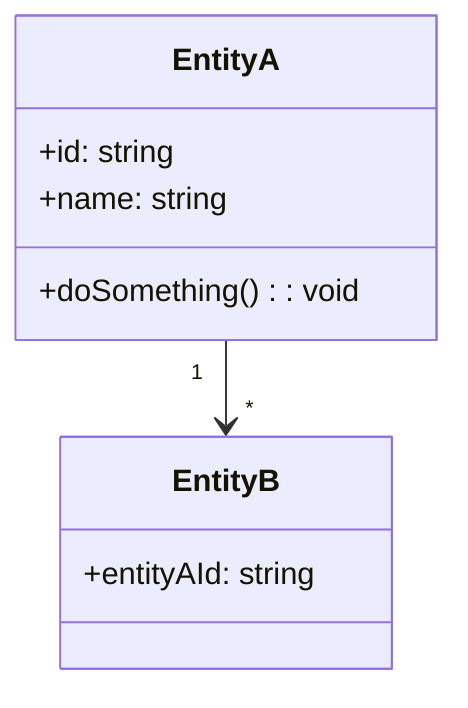
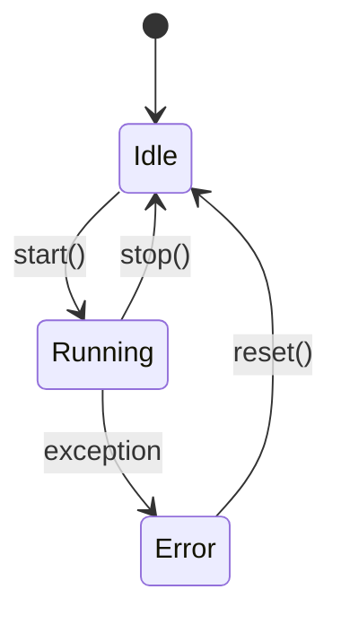

# SW Detailed Design

<!--
Software detailed design — "directly implementable" level.
This document goes below the architecture (sw-architecture.md) and specifies
modules, classes, state machines, and non-trivial algorithms.
Do not document what is obvious from the code itself.
-->

## 1. Main modules

| Module        | Responsibility                         | Package / Path          | Key dependencies |
|---------------|----------------------------------------|-------------------------|------------------|
| …             | …                                      | `src/…`                 | …                |

## 2. Class diagrams (key excerpts)

<!--
Document only non-trivial data structures or important hierarchies.
Prefer Mermaid to keep diagrams in the repo.
-->

## 3. State machines

<!--
For each state-driven behaviour (connection, session, workflow…).
-->

| State   | Description                          | Possible transitions  |
|---------|--------------------------------------|-----------------------|
| Idle    | …                                    | → Running             |
| Running | …                                    | → Idle, → Error       |
| Error   | …                                    | → Idle                |

## 4. Algorithms and non-trivial logic

<!--
Document here only what a developer could not deduce from the code alone:
hidden invariants, non-obvious optimisations, timing constraints.
-->

### [Algorithm name]

**Input**: …  
**Output**: …  
**Complexity**: O(…)  
**Constraint**: …

## 5. Error handling strategy

| Layer       | Convention                                                 |
|-------------|-------------------------------------------------------------|
| Domain      | Raise typed exceptions (no `any`)                          |
| Application | Convert to business error code                             |
| API         | Return unified error format (see api-contracts.md)         |
| Logging     | ERROR level with full stack trace                          |

## Reference

- SW Architecture: [../architecture/sw-architecture.md](../architecture/sw-architecture.md)
- API Contracts: [../architecture/interfaces/api-contracts.md](../architecture/interfaces/api-contracts.md)
- Data Model: [data-model.md](data-model.md)
